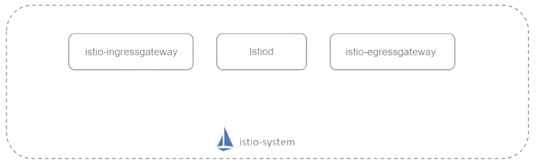

# Istio

## Service Mesh

It is a dedicated and configurable infrastructure layer that handles the communication between services without having to change the code in a microservice architecture.

## Envoy

The proxy used by Istio is [Envoy](https://www.envoyproxy.io/) and it's located in the same POD of our application as a sidecar, along this, there's another component called istio agent

## Control Plane (istiod)

* Citadel: Certificate generation
* Pilot: Service Discovery
* Galley: Help in validating configuration files

## Microservices Cross Cutting Concerns 

* Authentication
* Authorization
* Networking
* Logging
* Monitoring
* Tracing

> Microservices cons: 
>* Networking
>* Security
>* Observability
>* Overload for traditional operation Models

## Install Istio

curl -L https://istio.io/downloadIstio | sh -
cd istio-<version-number>
export PATH=$PWD/bin:$PATH
istioctl install --set profile=demo -y

## Enable Istio Sidecar

you must  explicity enable Istio Sidecar injection at a namespace level if you would like istio to inject proxy services as sidecars to the applciations deployed in a namespace.

`kubectl label namespace <MY-NAMESPACE> istio-injection=enabled`

> you can check the status of the mesh with the following command. `istioctl analyze`

## Kiali

Kiali is an observability console for Istio with service mesh configuration and validation capabilities. It helps you understand the structure and health of your service mesh by monitoring traffic flow to infer the topology and report errors. 

### [install Kiali](https://kiali.io/docs/installation/quick-start/)

`kubectl apply -f ${ISTIO_HOME}/samples/addons/kiali.yaml`

## Trafic Management

### Istio Gateways

Istio gateway describes a load balancer operating at the edge of the mesh receiving incoming or outgoing HTTP/TCP connections.

Istio supports Kubernetes ingress but there is also another approach that Istio offers and recommends in order to have more feature such advanced monitoring and routing rules, this is called Istio Gateway.



Istio deploys ingress gateways using Envoy proxies, all the services have an Envoy proxy deployed as a sidecard contianer, however, the ingress and egress gateways are just standalone Envoy proxies, sitting at the edge of the service mesh (the do not work as a sicard).

List the created wateways
- `kubectl get gateway`
- `kubectl get gw`

View details of an particular gateway
- kubectl describe gateway <GATEWAY_NAME>
  - `kubectl describe gateway my-gateway`

### Virtaul Services

- Virtual services define a set of routing rules for traffic coming from ingress gateway into the service mesh.
- All routin rules are configured through virtual services.
- Define a set of routing rules for traffic comming from ingress gateway.
- VS are flexible and powerfull.
- When a virtual service is created Istio control plane applies the new configuration to all the Envoy sidecar proxies.
- you can specify many rules, for example:
  - the routing percent for each service in the virtual service configuration file (ex: `weight: 95`).
  - send traffic to a specific service according to the user logged in ex:
    > ```
    > - headers: 
    >    end-user: 
    >      exact: testuser
    > ```
- Fault Tolerance: Introduce some errors to check if errors hanldling mechanisms are working as expected.
- Timeouts: if a service is taking to much time to respond it must no keep the dependent service waiting forever, it must fail after a period of time and return an error message.
- Retries: Attempt the operation again, Istio by default has the following configuration:
  - 25 ms+ intervals after 1st fail.
  - 2 retries before returning an error.

List the created virtual services
- `kubectl get virtualservice`
- `kubectl get vs`

### Destination Rules

- Destination rule defines policies that apply to traffic intended for a service after routing has occurred so with a destination rule you can add additional routing policies on top of a kubernetes services.
- The destination rules object creates subsets that are used in the virtual service object.
- Allows us to have different load balancer policies such as:
  - ROUND_ROBIN  (Default)
  - LEAST_CONN
  - RANDOM
  - PASSTHROUGH
- Circuit breaking: Mark the requests failed immediately instead of send them to the failing service.

List the created destination rules
- `kubectl get destinationrules`
- `kubectl get dr`